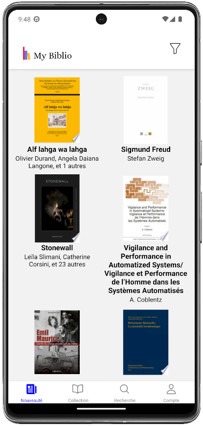
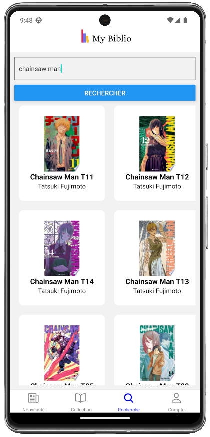

## Table des Matières
- [English description](#english)
  - [Key Features](#key-features)
  - [Configuring the Application](#configuring-the-application-english)
- [Description en français](#français)
  - [Caractéristiques Principales](#caractéristiques-principales)
  - [Configuration de l'Application](#configuration-de-lapplication-français)
- [Preview](#preview)

### English

**MyBiblio - Your Personal Digital Library Assistant**

Welcome to MyBiblio, the intuitive and user-friendly application designed to revolutionize the way you manage your personal book, comic book, and manga collection. Our aim is to simplify your reading experience by providing a seamless way to keep track of your home library, preventing the purchase of duplicate books and helping you discover new releases.

#### Key Features

- **Collection Management:** Easily add and organize your books, comics, and mangas with detailed information and custom categories.
- **New Releases Tracker:** Stay updated with the latest releases in your favorite genres. Never miss out on new publications.
- **Search Functionality:** Quickly find any book in your collection with our efficient search tool.
- **User-friendly Interface:** A clean and simple design that makes navigation a breeze.
- **Cross-platform Accessibility:** Use MyBiblio on both iOS and Android devices.

Whether you're a casual reader or a dedicated bookworm, MyBiblio is the perfect companion for your literary journey.

### Configuring the Application (English)

**Setting Up `config.js` for API Key and Language Preference**

To ensure the smooth running of MyBiblio, you need to set up a `config.js` file in the root of your project. This file will store your Google Books API key and the preferred language setting for book searches.

1. **Create a `config.js` file:**
   Navigate to the root of your project and create a new file named `config.js`.

2. **Add API Key and Language Preference:**
   In `config.js`, add the following code snippet:
   ```javascript
   const API_KEY = "YOUR_GOOGLE_BOOKS_API_KEY";
   const LANGUAGE = "fr"; // Change to your preferred language (e.g., "en" for English)

   export { API_KEY, LANGUAGE };
   ```

   Replace `"YOUR_GOOGLE_BOOKS_API_KEY"` with your actual Google Books API key.

---

### Français

**MyBiblio - Votre Assistant Personnel pour Bibliothèque Numérique**

Bienvenue sur MyBiblio, l'application intuitive et facile à utiliser, conçue pour révolutionner la façon dont vous gérez votre collection personnelle de livres, de bandes dessinées et de mangas. Notre objectif est de simplifier votre expérience de lecture en fournissant un moyen efficace de suivre votre bibliothèque personnelle, évitant ainsi l'achat de doublons et vous aidant à découvrir de nouvelles parutions.

#### Caractéristiques Principales

- **Gestion de Collection :** Ajoutez et organisez facilement vos livres, bandes dessinées et mangas avec des informations détaillées et des catégories personnalisées.
- **Suivi des Nouveautés :** Restez à jour avec les dernières sorties dans vos genres préférés. Ne manquez jamais une nouvelle publication.
- **Fonction de Recherche :** Trouvez rapidement n'importe quel livre dans votre collection grâce à notre outil de recherche efficace.
- **Interface Conviviale :** Un design épuré et simple qui rend la navigation facile.
- **Accessibilité Multiplateforme :** Utilisez MyBiblio sur les appareils iOS et Android.

Que vous soyez un lecteur occasionnel ou un bibliophile dévoué, MyBiblio est le compagnon idéal pour votre parcours littéraire.

### Configuration de l'Application (Français)

**Mise en Place de `config.js` pour la Clé API et la Préférence de Langue**

Pour assurer le bon fonctionnement de MyBiblio, vous devez configurer un fichier `config.js` à la racine de votre projet. Ce fichier stockera votre clé API Google Books et le paramètre de langue préféré pour les recherches de livres.

1. **Créez un fichier `config.js` :**
   Naviguez jusqu'à la racine de votre projet et créez un nouveau fichier nommé `config.js`.

2. **Ajoutez la Clé API et la Préférence de Langue :**
   Dans `config.js`, ajoutez le code suivant :
   ```javascript
   const API_KEY = "VOTRE_CLE_API_GOOGLE_BOOKS";
   const LANGUAGE = "fr"; // Modifiez selon votre langue préférée (par exemple, "en" pour l'anglais)

   export { API_KEY, LANGUAGE };
   ```

   Remplacez `"VOTRE_CLE_API_GOOGLE_BOOKS"` par votre véritable clé API Google Books.


### Preview




